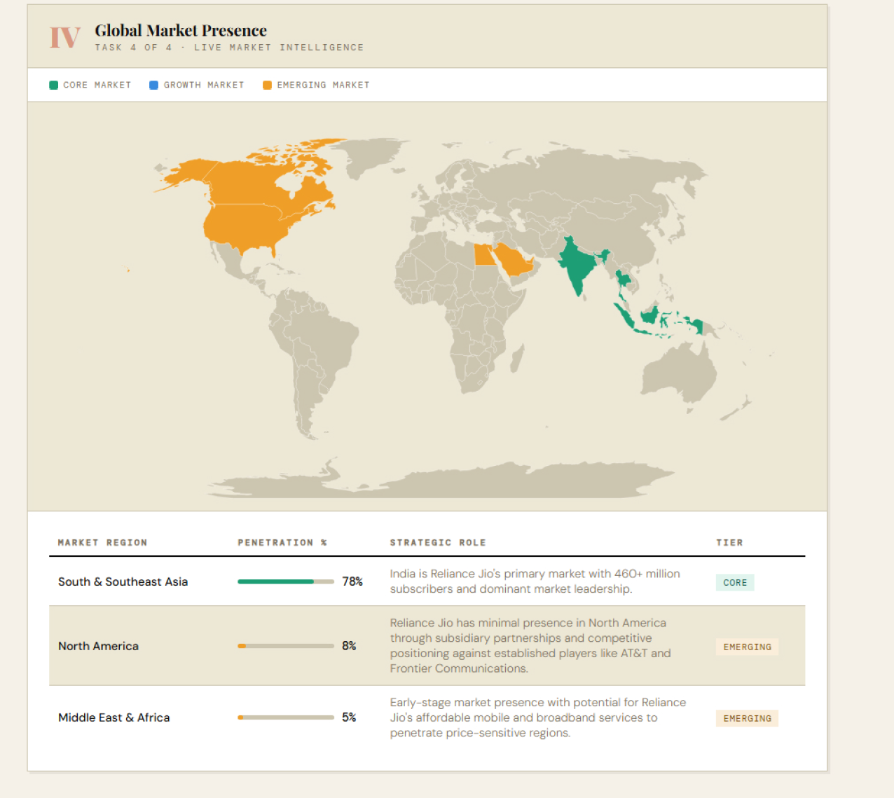

# Marketing Agents Project


# Strategos — Product Strategy AI Agent

A 5-agent AI pipeline that analyses any product using Kotler's Marketing Management frameworks.

## Project Structure

```
strategos/
├── config.js                   ← All keys, models, and settings (edit this)
├── server.js                   ← Entry point — orchestrates the pipeline
├── package.json
├── public/
│   └── index.html              ← Frontend UI
└── agents/
    ├── claude.js               ← Shared Anthropic API helper
    ├── researchAgent.js        ← Task 0: Web search & product summary
    ├── classifierAgent.js      ← Task 1: Kotler product classification
    ├── levelsAgent.js          ← Task 2: Five product levels + gap analysis
    ├── differentiatorAgent.js  ← Task 3: Differentiation strategies
    └── marketAgent.js          ← Task 4: Global market presence map
```

## Setup

### 1. Install dependencies
```bash
npm install
```

### 2. Set your API key
Get your key from https://console.anthropic.com

**Mac/Linux:**
```bash
export ANTHROPIC_API_KEY=sk-ant-your-key-here
```

**Windows:**
```cmd
set ANTHROPIC_API_KEY=sk-ant-your-key-here
```

### 3. Start the server
```bash
npm start
```

### 4. Open in browser
```
http://localhost:3000
```

## Configuration

All settings live in `config.js`. You can change:

| Setting | What it does |
|---|---|
| `ANTHROPIC_API_KEY` | Your API key (prefer env variable) |
| `MODELS.*` | Which Claude model each agent uses |
| `MAX_TOKENS.*` | Token budget per agent |
| `PORT` | Server port (default 3000) |
| `RESEARCH.MAX_SEARCHES` | How many web searches the research agent runs |
| `MARKET.MIN_REGIONS` / `MAX_REGIONS` | Number of market regions to identify |

## Agent Pipeline

```
User input
    ↓
researchAgent    — searches the web, returns structured product summary
    ↓
classifierAgent  — classifies product type (Kotler framework)  → Task 1
    ↓
levelsAgent      — maps five product levels + gap analysis      → Task 2
    ↓
differentiatorAgent — recommends 3 differentiation strategies   → Task 3
    ↓
marketAgent      — generates global market presence map         → Task 4
```

Results stream to the UI in real time as each agent completes.

## Estimated Cost per Run

Using `claude-haiku-4-5-20251001` for all agents: ~$0.08–0.15 per analysis.
